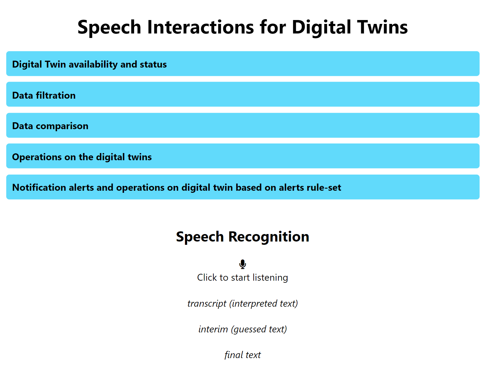

# SpeechInterface_DigitalTwins

Web application that implements Web Speech API for interaction with digital twins and performing operations on the digital twin with speech recognition.  

#### Digital Twin API - Back End

The web application retrieves the digital twin information and performs operations on the digital twin using the API request at the back-end. The digital twin API for the air quality, smart room and robot use-case can be referred from the github repository [ smart room api](https://github.com/cdl-mint/SmartHome_AirQuality_Authentication), and [robot api](https://github.com/cdl-mint/Robot_API)

# Getting Started with Create React App

This project was bootstrapped with [Create React App](https://github.com/facebook/create-react-app).

#### Pre-requisites:

The **NodeJs** software is required to run the React web application. The NodeJs is the javascript runtime environment that provides the npm(node pacakage manager). Through the npm, ypu can install packages and dependencies of the react web application. The NodeJs can be installed from the [website](https://nodejs.org/en).

Clone the repository, and run the npm install command to install the project dependencies. The project dependencies present in the node_modules folder is installed via the following 

````
npm install 
````

command. Once the project dependencies are installed, you can run the npm start command to start the development server.

## Available Scripts

In the project directory, you can run:

### `npm start`

Runs the app in the development mode.\
Open [http://localhost:3000](http://localhost:3000) to view it in your browser.

The page will reload when you make changes.\
You may also see any lint errors in the console.

After the application is loaded into the browser, you can see the following web page.



